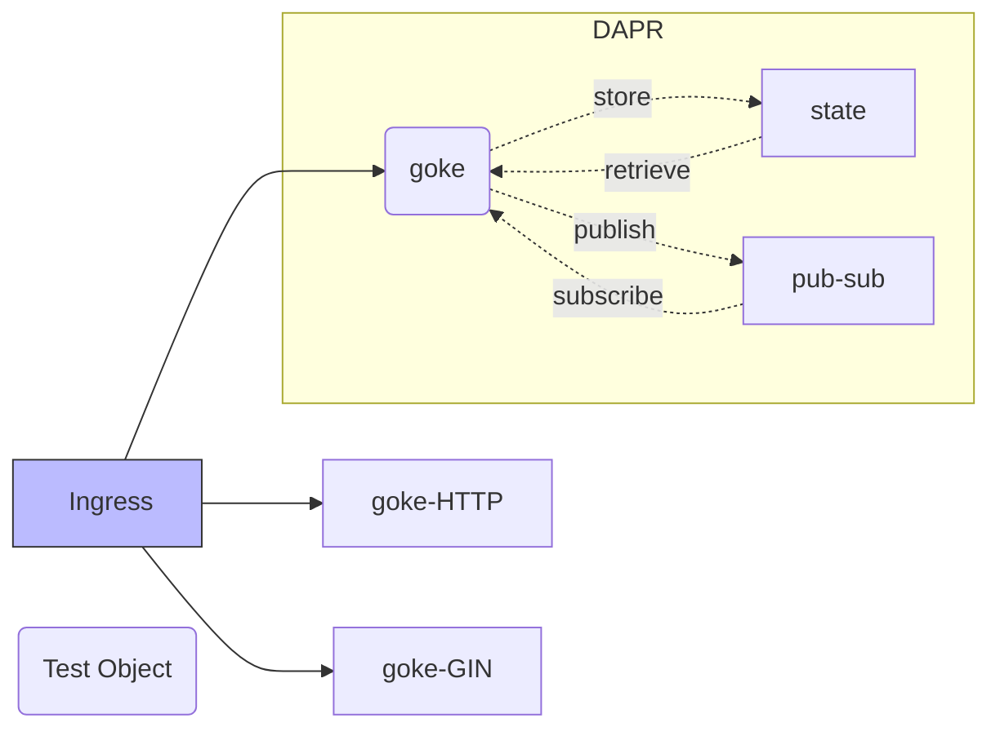
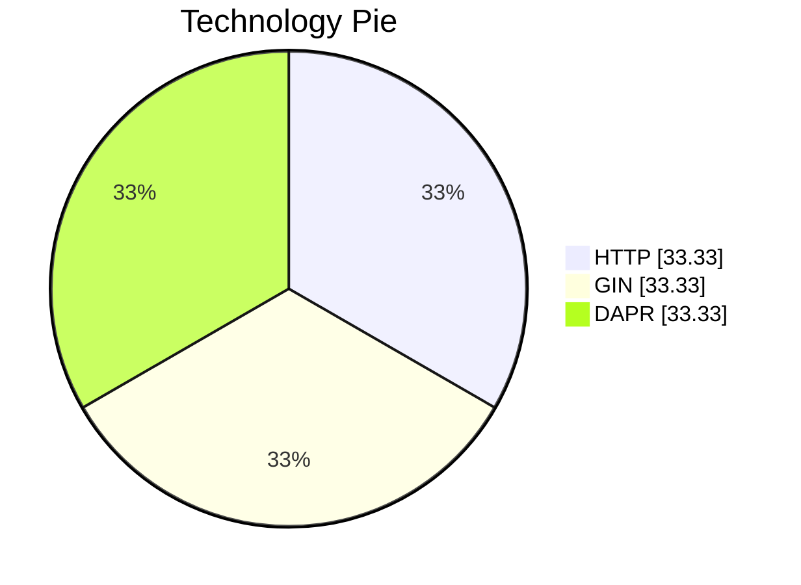

# goke
goke - Golang Kubernetes Example

- [goke](#goke)
  - [Diagrams](#diagrams)
  - [Repository Analytics](#repository-analytics)

## Diagrams

```mermaid
flowchart LR
    classDef style1 fill:#bbf,stroke:#333,stroke-width:4pxstroke-width:4px;
    in[fas:fa-split Ingress]
    class in style1
    in --> goke-HTTP
    in --> goke-GIN
    in --> gd(goke)
    gd -. store .-> state
    subgraph DAPR
    state -. retrieve .-> gd
    gd -. publish .-> pub-sub
    pub-sub -. subscribe .-> gd
    end
    test(Test Object)
```

```mermaid
pie showData
  title Technology Pie
    "HTTP": 33.33
    "GIN": 33.33
    "DAPR": 33.33
```

## Repository Analytics 

